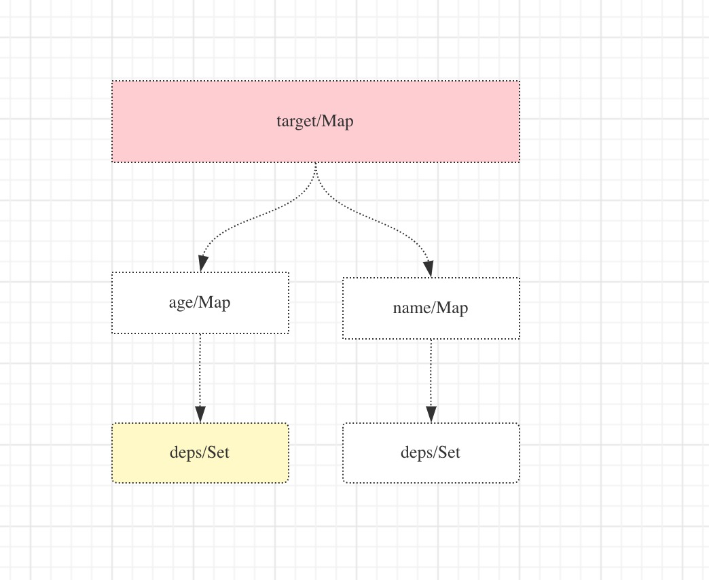

# Reactive

### Proxy
```typescript
const originalUser = { name: "user", age: 10 };
const proxyUser = Proxy(originalUser, {
    get(target, key, receiver) {
        // NOTE: 当访问被代理对象的人和属性时候将会触发get操作

        // do something

        // return any value as the return value of target[key]
        return Reflect.get(target, key);
    },

    set(target, key, value) {
        // NOTE: 当给被代理对象的属性设置新的值（proxyUser.age = 10; 或 proxyUser.age++）时候触发set行为

        // do something
        const newValue = Reflect.set(target, key, value);
        // do something
        return newValue;
    }
});
```

## Effect And Reactive
**effect**
```typescript
import { effect, reactive } from "vue";

const user = reactive({ age: 10 });
// reactive is entirely based on the proxy implementation, which can be understood as the above proxy
/**
 * Exactly equivalent to：
 * 
 * const user = new Proxy({ age: 10 }, {
 *      get(target, key) { 
 *          return Reflect.get(target, key);
 *      },
 *      set(target, key, value) {
 *          const newValue = Reflect.set(target, key, value);
 *          return newValue;
 *      };
 * });
 */

// 核心原理之一
effect(() => { 
    proxyUser.age + 10;
    // 这里proxyUser.age 触发get操作并且是处于effect中, fn会被作为依赖收集起来
    // 关于依赖项收集请看：下一小节依赖解析
});
proxyUser.age = 10; // 触发set操作, 派发对应的依赖项发生更新
```
**reactive**
```typescript
const user = new Proxy({ age: 10 }, {
    get(target, key) { 
        // ...
        track(target, key); // 就是上方所谓的依赖收集处
        // ...
    },
    set(target, key, value) {
        // ...
        trigger(target, key); // 依赖触发处
        // ...
    }
});

```
收集的关系为：
- 在设置时候
    - 通过target去设置的key，key设置对应的依赖
- 查找依赖的时候
    - 通过target去找到对应的key, key查找到和key相关的依赖deps
    